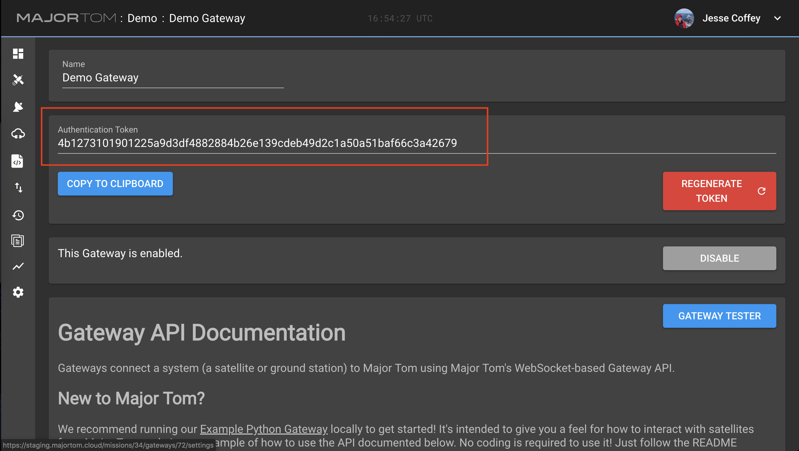
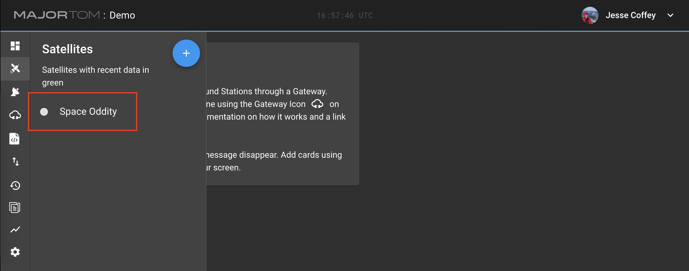

# Demo Gateway in Python

A Gateway is the translation layer between Major Tom's Mission Control and your Satellite. 
This repo contains example Gateways in both sync and async Python, and can be run natively or within a docker container.

## Quickstart

To start quickly, if you have docker, use `run-docker.sh` with the host and gateway token, like so:

```
./run-docker.sh YOUR_APP.majortom.com EXAMPLE15d8321821cbb3dde56b367c2346d766468d288b39b301254ee2ac
```

This creates an Example Satellite and populates commands that you can use to interact with the Gateway. 

(A Gateway Token is acquired by creating a Gateway in the Major Tom user interface.)

## Background

Gateways are asynchronous by nature -- the primary interface is a bi-directional websocket. Actions taken by the operator are sent from Major Tom to your Gateway as messages. The [underlying library](https://github.com/kubos/majortom_gateway_package) then executes methods based on the type of message. However, async Python can sometimes be challenging to write. So we created our API to support both sync and async programming styles.

## Sync Gateway

[This Gateway](./gateway/gateway.py) serves as an example of interacting with Major Tom using synchronous Python and the Gateway API. It creates an "Example Flatsat," which is separated in the code to show where the Gateway ends and the satellite begins. The run script will create this flatsat and populate it with commands. Once the Gateway is connected, you should execute those commands to see how the Gateway and satellite interact.

## Async Gateway
[This Gateway](./demo/demo_sat.py) serves as **both** an example of interacting with Major Tom using the async API and an embedded demo Satellite which responds to commands, generates telemetry, and uplinks/downlinks files. This Gateway is older, more robust, and can perform more actions than the sync Gateway, but there is not a clear separation between the Gateway code and the (faked) satellite code.

If you have any issues setting up/running these demos,
either [make an issue](https://github.com/kubos/example-python-gateway/issues/new) on this repository
or [come talk to us on Slack](https://slack.kubos.com) and we'll get you sorted out!

## Gateway Package

This demo gateway uses the [Major Tom Gateway Package](https://pypi.org/project/majortom-gateway/).
If you are looking to use this gateway as an example to write your own, use that package to handle messages to/from Major Tom.

## Local Setup

Clone locally to use it with Major Tom.

Requires Python 3.6+ and package requirements are in `requirements.txt`. Install with the command:

```pip3 install -r requirements.txt```

## Major Tom Setup

In addition to setting up your Local Environment, you'll need to make a Gateway in Major Tom!
Once you've received your login credentials for Major Tom, make a new mission,
and you'll be prompted to add a Gateway to that mission.

Once you add the Gateway, you'll need the __Authentication Token__ to connect the demo gateway. You can find it on the Gateway Page:



## Connect the Gateway

The `-h` (help) argument explains how to run the demo locally after you've set up the environment.
We __highly__ recommend reading the help menu, as it does contain all the detailed argument information.
Access this by running the following command from the repository's top level directory:

```python3 run.py -h```

For most Major Tom users, this will be your command line syntax:

```python3 run.py {MAJOR-TOM-HOSTNAME} {YOUR-GATEWAY-AUTHENTICATION-TOKEN}```

For Example:

```python3 run.py app.majortom.cloud 4b1273101901225a9d3df4882884b26e139cdeb49d2c1a50a51baf66c3a42623```

Once you run this, should should see Major Tom respond with a `hello` message:

```2019-08-19 12:04:46,151 - major_tom.major_tom - INFO - Major Tom says hello: {'type': 'hello', 'hello': {'mission': 'Demo'}}```

### Note on Major Tom Deployment Environments

If you have Basic Authentication enabled on your deployment
(usually true if you're accessing it over anything other than `app.majortom.cloud`),
you'll need to enter those credentials to connect.
Enter basicauth login credentials for your Major Tom deployment (if it’s active) with `-b {username}:{password}`,
for example: `-b kubos:password123`.
Run `python3 run.py -h` for the full information on how to include it.

If you are running the on-prem version of Major Tom,
you'll need to include the `--http` flag, as we currently do not support https for on prem.

## What does this Demo do?

Now that you've connected the gateway, it will automatically create a new satellite and load command definitions for it.

You can now issue those commands to the satellite through the connected Gateway,
which accomplish a wide variety of simulated tasks.
Open each command and read its description to understand what it does!

To find these commands, go to Major Tom under the mission you originally created and look up Space Oddity in the Satellites Menu:  



Clicking on it will take you to its commanding page, and you can fire away!

## What's Next?

### Set up your Mission Dashboard

The Mission Dashboard allows you to monitor and control everything on the Mission.
Add cards and play with their settings to see what you can do!

### Integrate Your System

Now that you understand how the integration works, try augmenting the Demo Satellite to actually communicate with your hardware/software!
Then you can begin controlling and monitoring your own spacecraft.

## Development and Test

To run tests continuously as you develop:
```
./bin/docker-testw.sh
```

To run a development instance (which uses a local python-gateway-package)
```
./bin/run-dev.sh [args]
```
